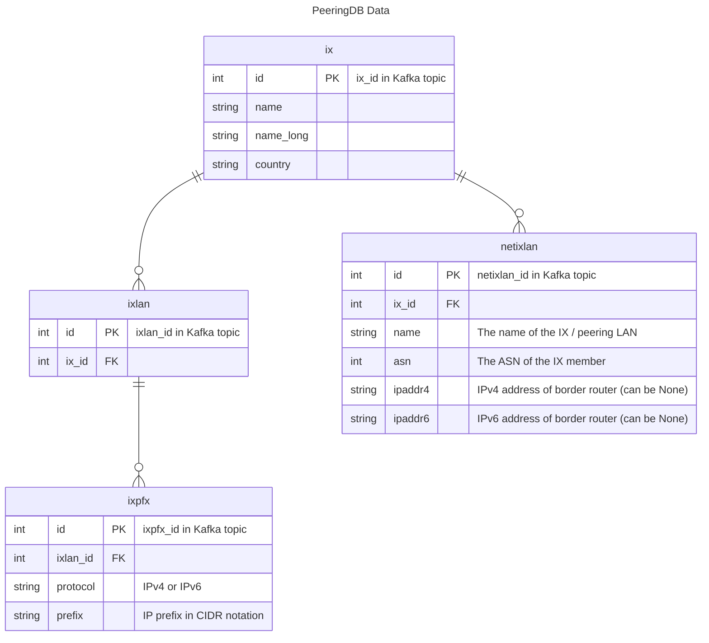

# PeeringDB

These producers create / produce data to two topics:
1. `ihr_peeringdb_ix` for IX information like name, country, and, most important, peering LAN prefixes.
2. `ihr_peeringdb_netixlan` for IX members and their router IPs.


# Usage

There are three ways to run this component:

1. locally on your machine, you have Kafka cluster setup.
2. Use Docker Compose, which setups a one broker Kafka cluster and runs the script.
3. Use Docker, you need to have Kafka cluster setup on host machine.

In all cases you needed to set an environment variable `KAFKA_HOST`


## 1. Locally

- install dependecies:
```bash
pip install -r requirements.txt
```

- run ix
```bash
KAFKA_HOST=host:9092 python ix.py
```

- run netixlan
```bash
KAFKA_HOST=host:9092 python netixlan.py
```

## 2. Docker Compose

- install [Docker](https://docs.docker.com/engine/install/) & [Docker Compose](https://docs.docker.com/compose/install/)

- change directory to peeringdb producer
```bash
cd ./peeringdb/producers
```

- run both ix & netixlan
```bash
docker compose up -d
```

- follow detector logs
```bash
docker compose logs -f ix netixlan
```

- to stop
```bash
docker compose down
```

**Note:**

1. use `docker compose` or `docker-compose` depending on your system
## 3. Docker

- install Docker from [here](https://docs.docker.com/engine/install/)

- run ix
```bash
docker run --rm --name ix \
    --env KAFKA_HOST="host:9092" \
    internethealthreport/peeringdb ix.py
```

- run netixlan
```bash
docker run --rm --name netixlan \
    --env KAFKA_HOST="host:9092" \
    internethealthreport/peeringdb netixlan.py
```


# Logging

- Logs are pushed to stdout and accessible using:

```bash
docker logs -f ix-container-name
```

## Requirements

- [requests](https://github.com/kennethreitz/requests) to fetch data from PeeringDB.
- [confluent_kafka](https://github.com/confluentinc/confluent-kafka-python) to connect to Kafka.
- [msgpack](https://pypi.org/project/msgpack/) to compress messages of the Kafka topics.
- A Kafka server behind one of: `kafka1,kafka2,kafka4,kafka4`.

Install Python dependencies via
```bash
pip3 install -r requirements.txt
```

## About PeeringDB Data

Below is an ER diagram that contains only the fields that are used and/or pushed to the Kafka topics.
The `ix.py` producer combines information from the `ix`,`ixlan`, and `ixpfx` tables, whereas
`netixlan.py` only uses data from `netixlan`.

We mainly care about two properties:
1. The peering LAN(s) of an IX
2. The IPs of the border routers owned by IX members

The actual prefix of a peering LAN is the `prefix` property of the `ixpfx` table. To map the prefix
to the IX, we need to connect via the `ixlan` table that otherwise contains only information we are
not interested in.

Since we store the IX information like name and country in the `ix` topic, we do not make the
connection again when fetching the `netixlan` table. The relationship is only included in the
diagram for clarity.

**NOTES**
- An IX can have more than one peering LAN.
- An IX member can have multiple `netixlan` entries for the same IX, i.e., `(ix_id, asn)` is not
unique. Furthermore, one or both of `ipaddr4` and `ipaddr6` can be set.


